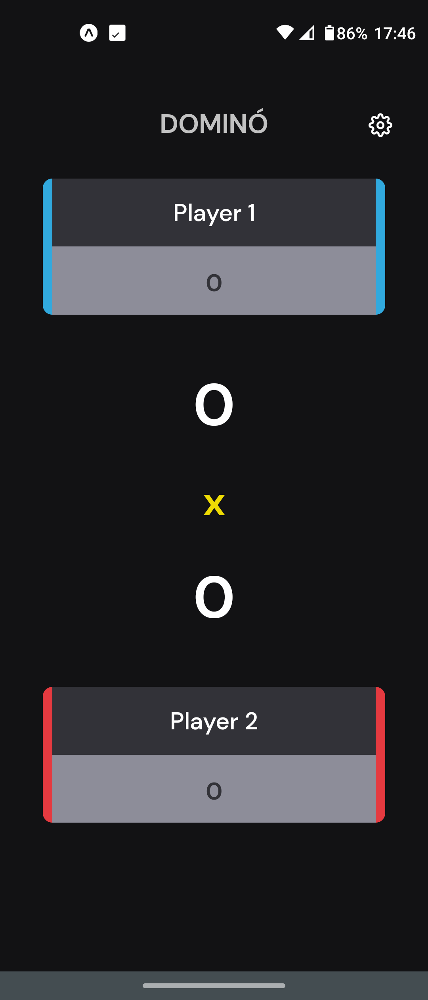

<h1 align="center">Placar Dominó</h1>

 

    Placar básico, desenvolvido em React Native, com funcionalidades básicas para marcar os jogos de dominó.

 

  <a href="#layout">Layout</a>&nbsp;&nbsp;&nbsp;|&nbsp;&nbsp;&nbsp;
  <a href="#tecnologias">Tecnologias</a>&nbsp;&nbsp;&nbsp;|&nbsp;&nbsp;&nbsp;
  <a href="#tecnologias">Regras do jogo</a>&nbsp;&nbsp;&nbsp;

 

## Layout

  

 

## Tecnologias

Esse projeto foi desenvolvido com as seguintes tecnologias:

- React Native
- Expo
- Github

 

## Regras do Jogo

A cada partida ganha, um ponto deve ser marcado no *Placar Parcial*. Tanto do *Jogador1* como do *Jogador2*. 
O Jogador que conseguir três pontos consecultivos, marcará um ponto no *Placar Geral* automaticamente. 
Se o *Jogador1* já tiver pontos marcados no *Placar Parcial* e o *Jogador2* marcar ponto, 
os pontos do *Jogador1* serão zerados automaticamente. E vice-versa.

O Jogador que marcar mais pontos no *Placar Geral* ou um limite definido pelos jogadores, ganha o jogo.

Tanto o *Placar Geral* como o *Placar Parcial* podem ser zerados a qualquer momento do jogo, 
instruções nas Configurações.

 

***
