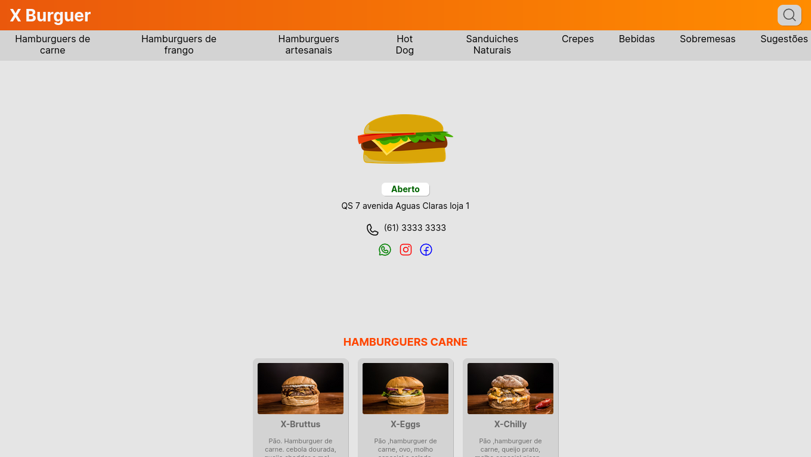

<h1 align="center"> Cardápio Digital </h1>

Um cardápio no seu smartphone!
Para facilitar a vida do cliente e do garçom!

  <a href="#-tecnologias">Tecnologias</a>&nbsp;&nbsp;&nbsp;|&nbsp;&nbsp;&nbsp;
  <a href="#-projeto">Projeto</a>&nbsp;&nbsp;&nbsp;|&nbsp;&nbsp;&nbsp;
  <a href="#-layout">Layout</a>&nbsp;&nbsp;&nbsp;|&nbsp;&nbsp;&nbsp;

 

  

## 🚀 Tecnologias

Esse projeto foi desenvolvido com as seguintes tecnologias:

- ReactJS
- Typescript
- GIT
- Github

## 💻 Projeto

O Cardápio Digital é um cardápio que pode ser visualizado por qualquer computador ou 
dispositivo móvel como smartphones e tablets, através de um link ou até mesmo um QR-Code. 
Trazendo as informações do cardápio fisíco direto par um meio digital. 

## 🔖 Layout

Você pode visualizar o layout do projeto através [DESSE LINK]()
